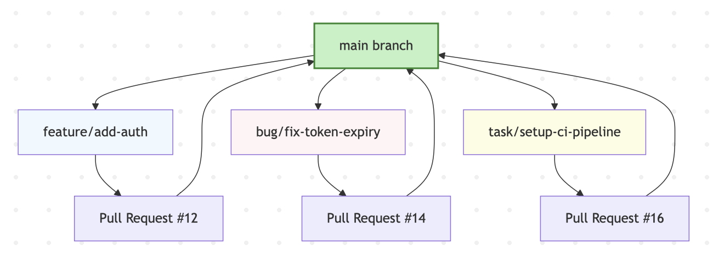

# Branching Convention

This document defines the Git branching strategy used in this project. It ensures clarity, consistency, and traceability
across all contributions — even for a solo project. This approach is inspired by professional-grade workflows, adapted
for solo and small-team development.

---

## Guiding Principles

- The `main` branch is **always stable and deployable**
- Each issue (bug, feature, or task) is developed in a **dedicated branch**
- Branch names follow a consistent, readable format
- Pull Requests are used to document every change, even if authored solo
- All branches are linked to an Issue for traceability

---

## Branch Types & Naming Convention

| Type     | Branch Pattern          | Example                        |
|----------|-------------------------|--------------------------------|
| Feature  | `feature/<short-desc>`  | `feature/user-authentication`  |
| Bug Fix  | `bug/<short-desc>`      | `bug/fix-token-expiry`         |
| Task     | `task/<short-desc>`     | `task/setup-ci-pipeline`       |
| Refactor | `refactor/<short-desc>` | `refactor/extract-token-utils` |
| Docs     | `docs/<short-desc>`     | `docs/update-readme`           |

- Use `kebab-case` for readability
- Keep branch names short but descriptive
- Link branches to issues using the PR description (`Closes #<issue-number>`)

---

## Branching Workflow (Git Branching Strategy)



---

## Workflow Steps

### 1. Create or choose an issue

Every branch starts with a GitHub issue (Bug, Feature, or Task).

### 2. Create your branch from `main`

```bash
git checkout main
git pull
git checkout -b feature/login-form