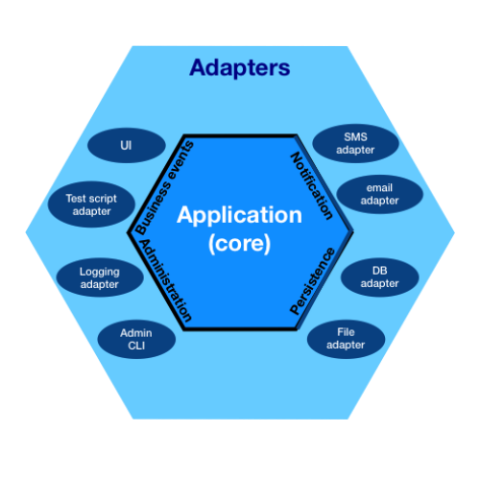

# Homelab Security Monitoring System


## Overview

The **Homelab Security Monitoring System** is a microservice-based project designed to enhance security monitoring in a
homelab environment. It consists of:

- **Audit Logging Service**: Logs security events (failed login attempts, successful logins, system modifications,
  unauthorized access, etc.).
- **User Notification Service**: Sends real-time alerts via email, WebSockets, or webhooks when a security event occurs.
- **Kafka Event Streaming**: Used for asynchronous processing and real-time event distribution.
- **CI/CD & DevOps**: Leveraging GitHub Actions, OpenShift for automated deployment.

This project follows the **Hexagonal Architecture (Ports and Adapters Pattern)** to ensure a clean separation between
business logic and external dependencies.

---

## What is Hexagonal Architecture?

**Hexagonal Architecture** (also called **Ports and Adapters**) is a software design pattern that promotes:

- Decoupling between the core business logic and external systems (databases, APIs, messaging systems).
- High testability by allowing easy replacement of external dependencies with mocks.
- Better maintainability and scalability, especially in microservices.



### **Core Principles:**

1. **Domain Layer**: Contains the core business logic and domain models (pure Java objects without dependencies on
   frameworks).
2. **Application Layer**: Orchestrates use cases and interacts with domain logic.
3. **Ports** (Interfaces): Defines how external systems (databases, message queues, APIs) should interact with the
   domain.
4. **Adapters** (Implementations): External services such as repositories (database access), messaging (Kafka), and
   notifications.

---

## **Hexagonal Architecture in Our Microservice Project**

Each microservice in our project will follow this structure:

```
security-audit-service/   
│── src/main/java/com/homelab/security/audit/  
│   ├── domain/                # Core Business Logic (Entities, Services, Use Cases)
│   ├── application/           # Application Logic (Orchestrates Use Cases)
│   ├── infrastructure/        # External Adapters (Database, Kafka, REST Clients)
│   │   ├── repository/        # Implements Database interactions
│   │   ├── messaging/         # Kafka producer/consumer
│   │   ├── web/               # REST Controllers (APIs)
│── tests/                    # Unit and Integration Tests
│── pom.xml                    # Dependencies and Build Configuration
```

### **How It Works in Our System**

1. **Security Events are Triggered** (e.g., failed login attempt, unknown device access).
2. **Audit Service Receives Event**
    - The REST API records the event.
    - The database adapter saves it in **Oracle**.
    - The Kafka producer sends an event to the `security-events` topic.
3. **Notification Service Listens for Events**
    - Kafka consumer receives the event.
    - Notification adapter sends an **email alert** or **WebSocket event**.
4. **CI/CD Pipeline Deploys Services**
    - GitHub Actions runs tests, builds images, and deploys to **OpenShift**.

---

## **Technologies Used**

- **Java 17 + Spring Boot** (Backend services)
- **Kafka** (Event-driven architecture)
- **Oracle Database + JPA** (Persistence layer)
- **GitHub Actions + OpenShift** (CI/CD & Deployment)
- **JUnit** (Testing)
- **WebSockets, Email, Webhooks** (Notifications)

---

## **Contributing**

Interested in the process or thinking of contributing?  
→ [See CONTRIBUTING.md](CONTRIBUTING.md)

---

## **Project Workflow**

This project applies a professional Git workflow based on issue-driven development.

-  Each branch starts from `main`
-  Work is grouped into:
   - `feature/<short-desc>`
   - `bug/<short-desc>`
   - `task/<short-desc>`
-  All branches go through a Pull Request before merging
-  Issues and PRs are cross-linked (`Closes #42`)

See full [Branching Convention](./BRANCHING_CONVENTION.md)

---

This project serves as a **real-world demonstration of security monitoring**, event-driven systems, and **best practices
in microservices architecture with Hexagonal design**. 🚀

## **License**
This project is licensed under the MIT License. See the [LICENSE](LICENSE) file for details.
```

